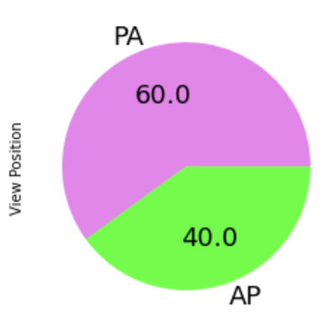

# FDA  Submission

**Your Name: Gaganjot Kaur**

**Name of your Device: Pneumonia Detector Assistant**

## Algorithm Description  

### 1. General Information

**Intended Use Statement:**
This algorithm is intended to assist the radiologists in detecting Pneumonia. Most of the time, the radiologits go through negative radigraphs which adds to the exhaution and burn-out. With the help of this algorithm, the radiologists will feel productive while going through the radiographs. 

**Indications for Use:**
The algorithm to detect Pneumonia is intended for use for both the genders of age randing from 1 to 95. The algorithm is trained on radiograph images only, therefore CT or MRI images are not valid. Also, the images with certain positions of the patient are acceptable such as images with positions 'AP" or 'PA'. Pneumonia can comorbid with other respiratory or heart diseases like infiltration, edema, atelectasis, mass, nodule, effusion, cardiomelagy, consolidation, fibrosis, hernia, emphysema. 

**Device Limitations:**
- The algorithm's performance can be impacted in the presence of other diseases like Infiltration, Atelectasis, Edema or Effusion which occur quite commonly alongwith Pneumonia and can be labelled as Pneumonia by the algorithm.
- The latency of the inference component of the algorithm is dependent on the presence of an adequate size of GPU. Th lack of it might cause delay in case of large volume of inference data in a fast paced environment.

**Clinical Impact of Performance:**
The algorithm is designed to assist the radiologists in detecting Pneumonia and will rightly do so. The impact of the high performance of this algorithm will help identify/detect Pneumonia correctly with high confidence which can help direct the patient towards further tests and treatments as soon as possible which can help save patient's life. The confidence of detecting the positive Pneumonia cases is 80% which is also called the true positive rate. 
But the algorithm also has a significant false positive rate because the trheshold has been chosen to produce high recall which results in detecting Pneumonia even when it is not there. After retrieving the result from the algorithm, it will depend on the radiologist to give the final decision. 
With high, the algorithm becomes more sensitive towards the positive cases which means if there is a Pneumonia positive case, the algorithm is highly likely to flag it as Positive to alert the radiologist to look deeply. 

### 2. Algorithm Design and Function

**DICOM Checking Steps:**
It is important to filter the patient's images retrieved from radiologists to keep only those images which are valid for the algorithm. Therefore, following specifications are checked before proceeding-
- **Modality**: The modailty should be 'DX' which signifies the image to be a radiograph
- **Patient Position**: The patient position should either be Anterior to be Anterior to Posterior (AP) or Posterior to Anterior (PA).
- **Body Part Examined**: Since, the algorithm was modeled on chest images, therefore, it is required to check if the image fed into the algorithm includes Chest.

**Preprocessing Steps:**
For inference and validation, the images are just rescaled by dividing the pixels by 255. This is followed by resizing the image to 224x224. 
For training, apart from scaling and resizing, the images are augmented to get a variety in the dataset that adds some distinction and noise to avoid overfitting.

**CNN Architecture:**
CNN architecture used for this model is added as an extension to the pre-trained VGG-16 model. The first 16 layers of VGG are set to freeze. Th last layer is then fed into the CNN architecture. 
Following are the list of layers added in the extension - 
1. Flatten()
2. Dropout(0.5)
3. Dense(1024, activation='relu')
4. Dropout(0.5)
5. Dense(512, activation='relu')
6. Dropout(0.3)
7. Dense(1, activation='sigmoid')

All the drop-out layers are added to prevent over-training and over-fitting. The last dense layer has an activation function set to sigmoid in order to get the output in range of [0,1].

### 3. Algorithm Training

**Parameters:**
* Types of augmentation used during training:
 - Rescaling the pixels by dividing them with 255
 - Horizontal flipping (no vertical flipping)
 - Height adjustment by 10%
 - Width adjustment by 10%
 - Add a shear factor of 0.1
 - Rotating the image by 10 degrees (Too much rotated image does not exists in the real scenario)
 - Zooming the image by a factor of 0.1 (Zooming too much can cause loss of details of imaging)

* Batch size: 32

* Optimizer learning rate: 0.0001

* Layers of pre-existing architecture that were frozen: 16

* Layers of pre-existing architecture that were fine-tuned: 3

* Layers added to pre-existing architecture: 7

* Model training patience: 10 (to stop the model after 10 epochs if no improvement in the binary accuracy is witnessed to avoid overfitting)

* Total number of epochs: 15 (Trained few times with different epochs like 5, 10, 20 but training and validation accuracies were stabilizing nicely with 15 epochs)

**Training and Validation Results** 
We were evaluating the training and validation results with two metrics namely Binary Accuracy and Loss. Maximum validation accuracy achieved was 66%. The loss for training kept on decreasing as the epochs progresssed but the validation loss decreased to its minima until Epoch 8 but kept on fluctuating between 0.65 and 0.75 which meant the model has started overfitting after that. 

The AP score is 0.68 and the AUC score is 0.68 as well. 

**Final Threshold and Explanation:**
The model predicts in the form of probabilities which can lie between [0,1]. To identify whether the image classifies as Pneumonia positive or negative, a threshold decided. When decising a threshold, we have to weigh what is more worse for us to tolerate between detecting Pneumonia when actually it is not there or missing the cases of Pneumonia. 

Certainly, the weightage has to be applied towards reducing the scenarios of missing a Pneumonia case when it was actually there as the algorithm will then be rendered useless. This means leaning more towards increasing recall. Since, there is a tradeoff between Recall and Precision, an optimal threshold needs to be decided that does not misses any Pneumonia but also produces lesser false positives. 

To estimate the right threshold, the graphs are plotted between various metrics like F1 score, precision, recall and threshold as below - 

From the graphs above, F1 score is close to 0.7 for thresholds ranging between 0 and 0.5 and then decreases sharply which leaves us even more confused for choosing one value for threshold. 

Therefore, we will peek into the graphs plotted for Precion and Recall based on the threshold. Since, the impact of detecting a false negative will be much more worse than detecting a false positive. Hence, it is important to value recall more than precision to choose our threshold. Having that said, we also don't want a high number of false positive cases which can affect the credibility of the algorithm and can also lead to adding more expenses to do further tests on patients.

A threshold between 0.4 - 0.5 will be a good balance to choose as it also weighs more on the Recall score and provides a reasonable Precision score. 

Going ahead with the threshold of 0.45

### 4. Databases
**Distribution of Dataset**
A huge imbalance is witnessed in the dataset which has only 1.3% of the cases that are Pneumonia positive while other 98.7% of the total 112,104 records of radiographs are having no signs of Pneumonia. 

**Gender Distribution** 
The dataset has approximately equal distribution of records of both the gender.

**Age Distribution**
The age range of the patients has a normal distribution between age 1 to age 95 for both the gender. This is true for all the cases as well as Pneumonia positive cases as well as shown in plots below.

**View Position Distribution**
There are only two types of Xray view positions present in the dataset - 'AP' and 'PA'. The dataset is almost equal distribution of both the cases as shown in the pie chart below. 

**Description of Training Dataset:** 
Since there are just 1.3% of the positive cases for Pneumonia and the rest 98.7% of the dataset has no cases for Pneumonia. We have made sure when we split the dataset, we have equal distribution of positive and negative samples in both train and validation dataset. 1.3 % of 112,104 accounts for approximately 1400 positive cases.

The dataset undergoes a stratified split of 80:20 between training and validation. 

Consequently, 80% of the 1400 positive Pneumonia records are kept in the training dataset. Since, we do not want the presence of skewed or imbalanced classes in the training dataset, therefore equal number of negative Pneumonia records are randomly sampled from 98.7% of the total cases which are negative. 

This ensures 50:50 ratio of negative and positive samples in the training dataset. The total number of records in the training dataset is 2290 (including negative and positive Pneumonia samples)

Also, as discussed above the age, gender and view position distributions are almost equal, the distribution remains the same in the training dataset as well.

**Description of Validation Dataset:** 
Similar to training dataset, the validation dataset contains 50:50 ratio of both negative and positive Pneumonia records. 20% of the total positive Pneumonia records are kept in validation dataset and similar number of negative records randomly samples from 98.7% of the total cases which are negative. 

Thus, the total number of samples present in validation dataset is 572. 

### 5. Ground Truth
The NIH Chest X-ray Dataset is comprised of 112,120 X-ray images with disease labels from 30,805 unique patients. To create these labels, the authors used Natural Language Processing to text-mine disease classifications from the associated radiological reports. The labels are expected to be >90% accurate and suitable for supervised learning. If there has been a human in the loop for generating the labels, it would be considered as gold-standard and the accuracy of labeling would be more than 90%. 

But artficially generated labels are good enough with more than 90% accuracy as involving humans to validate the labels would have been very expensive. This keeps the process robust. But the limitations of using NLP is it's dependence on computation resources for generating labels which becomes a liability for the success of the project.  

### 6. FDA Validation Plan

**Patient Population Description for FDA Validation Dataset:**
To check the validity of this algorithm, the patient population dataset needs to be collected while keeping the following constraints in picture -
- The patient population can include male or female of age ranging anywhere between 1 to 95
- The dataset can only include radiograph images. The CT scans or MRI images are not valid for this algorithm.
- The dataset can only contain Chest radiographs.
- The radiograph images captured with either AP or PA view positions are valid
- The symptoms of the patient can be comorbid with any of these 13 diseases - Atelectasis, Consolidation, Infiltration, Effusion, Edema, Emphysema, Fibrosis, Pleural Thickening, Pneumonia, Cardiomegaly, Nodule, mass or Hernia

**Ground Truth Acquisition Methodology:**
The objective of this algorithm is to assist the radiologists in detecting Pneumonia. The ground truth of the FDA validation dataset will have to be labelled by the radiologists. The quality and accuracy of labelling depends on the qualification and experience of the radiologists chosen. A qualified and experienced radiologists will be highly accurate and will prove to be a good idea for setting the silver standard. 

**Algorithm Performance Standard:**
According to the ChexNet paper, the average radiologists F1 Score was approximately 0.34 while this algorithm which can assist the radiologists has the F1 score 0.71 which is almost double. This proves that the radiologists will feel far more productive with the assistance of this tool to help them make decisions quickly. 
The precision score of the algorithm is 0.62 while the recall is 0.8 which means the algorithm is more focussed on not suggesting False Negatives. 
